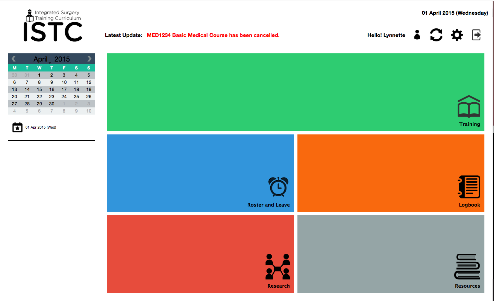

# Integrated Surgery Training Curriculum

Integrated Surgery Training Curriculum provides surgeons with an integrated platform to manage their trainings, researches and administrative duties like their training activities, leave applications, call rosters, personal notes and assessments. 

This project is supervised by Associate Professor Leow Wee Kheng from School of Computing (SoC) of National University of Singapore (NUS) and Consultant Surgeon Dr Ooi Oon Cheong from the National University Heart Centre, Singapore. Jai Sule (Star Trainee) from the National University Hospital (NUH) will assist Dr Ooi in overseeing the project. 

This is built with Qt and C++. The server side is done using PHP. It will be migrated to the NUH Server in time to come. 

This is a cross-platform development, supported on Windows, Mac, iOS (notably for iPad), Android tablets and Windows Tablets.

ISTC is developed by students from NUS School of Computing: Chan Jun Wei, Chua Chin Siang, Ong Teck Sheng, Ng Hui Xian and Ong Shi Rong. 

Product Videos
------

[Initial GUI Walkthrough Video] (https://youtu.be/r3phvGhupF0)

[Final Product Video] (https://youtu.be/KFASipw75Xw)

For a walkthrough of Screenshots, see [Screenshots](./screenshots/screenshots.md)

Release can be found here: https://github.com/quarbby/ISTC-/releases/tag/V1.3
